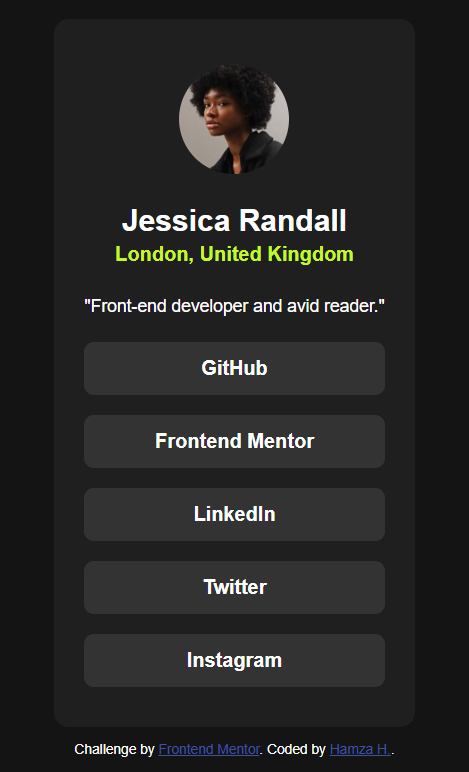
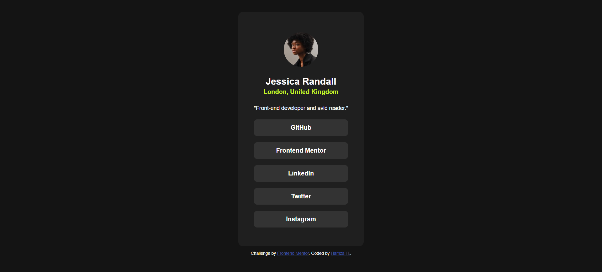
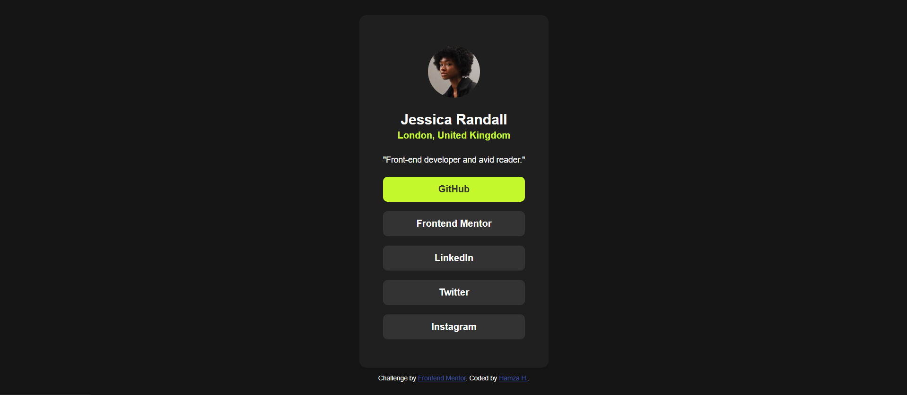

# Frontend Mentor - Social Links Profile Solution

This is a solution to the [Social Links Profile challenge on Frontend Mentor](https://www.frontendmentor.io/challenges/social-links-profile-UG32l9m6dQ). Frontend Mentor challenges help you improve your coding skills by building realistic projects.

## Table of Contents

- [Overview](#overview)
  - [The Challenge](#the-challenge)
  - [Screenshot](#screenshot)
  - [Links](#links)
- [Built With](#built-with)
- [What I Learned](#what-i-learned)
- [Useful Resources](#useful-resources)
- [Author](#author)

## Overview

### The Challenge

Users should be able to:

- See hover and focus states for all interactive elements on the page.
- View the social links in a structured and accessible manner.

### Screenshot






### Links

- [Solution URL](https://github.com/hhamza1/social-links-profile)
- [Live Site URL](https://hhamza1.github.io/social-links-profile/)

## Built With

- Semantic HTML5 markup
- CSS custom properties
- Flexbox
- Mobile-first workflow
- Google Fonts ([Inter](https://fonts.google.com/specimen/Inter))

## What I Learned

This project helped refine my understanding of:

- Structuring accessible and visually appealing profile cards.
- Using `Flexbox` for vertical alignment and spacing.
- Implementing smooth hover effects for interactive elements.

Here's a snippet showcasing the hover effect for the social links:

```css
.sm-link:hover {
    background-color: #c4f82a;
    color: #333;
}
```

## Useful Resources

- [MDN Web Docs - Flexbox Guide](https://developer.mozilla.org/en-US/docs/Learn/CSS/CSS_layout/Flexbox) - A great reference for mastering Flexbox.
- [CSS Tricks - Button Styling](https://css-tricks.com/buttons-with-flexbox/) - Helped with refining button styles.

## Author

- GitHub - [hhamza1](https://github.com/hhamza1)
- Frontend Mentor - [@hhamza1](https://www.frontendmentor.io/profile/hhamza1)

Let's build and learn together! 🚀